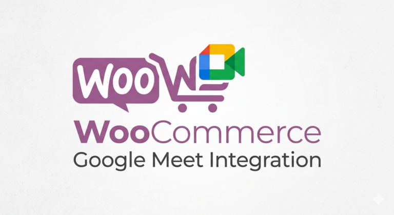

<p align="center">
  
</p>

# WooCommerce Google Meet Integration

Seamlessly integrate Google Calendar and Google Meet with WooCommerce. Let customers book available time slots on your product pages — when an order completes, the plugin creates a Google Calendar event with an optional Google Meet link and sends branded HTML emails to both customer and admin.

## Features

- **Event Picker on Product Pages** — Customers browse available slots via a month/year picker and select one before adding to cart.
- **Google Calendar Sync** — Reads availability from a source calendar; creates reservation events in a dedicated reservations calendar.
- **Automatic Google Meet Links** — Optionally generate Meet conference links on every reservation.
- **Branded HTML Emails** — Customizable email templates with your logo, colors, header/footer text, sender name, and reply-to address.
- **Dual Notifications** — Send booking confirmations to customers and order alerts to admin recipients (configurable list).
- **Validation & Dedup** — Validates selected events (exists, not in past, not already in cart) before allowing add-to-cart.
- **Order Integration** — Displays booking details in cart, checkout, and order admin. Hidden meta keys keep internal data clean.
- **Admin Controls** — Per-product enable/disable checkbox, force-resend meeting email from order list, and a dedicated settings panel.
- **OAuth Authentication** — Authenticate with Google via standard OAuth web flow, with automatic token refresh.

## How It Works

1. **Admin configures** the plugin with Google OAuth credentials, source/reservation calendars, and email preferences.
2. **Admin enables WGM** on a per-product basis via the WooCommerce product metabox.
3. **Customer visits product page** → event picker loads available slots from the source calendar via REST API.
4. **Customer selects a slot** and adds to cart → slot validated for existence, date, and uniqueness.
5. **Order completes** → original event deleted from source calendar, new event created in reservations calendar with customer details, optional Google Meet link generated.
6. **Emails sent** — branded HTML to customer (confirmation + Meet link) and admin(s) (order alert).

## Requirements

| Dependency | Version |
|------------|---------|
| WordPress | 6.x+ |
| WooCommerce | 9.x+ |
| PHP | 8.0+ |
| Google API credentials | OAuth 2.0 Web Application |

## Installation

### From Source

```bash
git clone https://github.com/lucaf/woocommerce-meetings.git
cd woocommerce-meetings
composer install --no-dev
```

Upload the plugin directory to `wp-content/plugins/woo-gmeet/` and activate from the WordPress admin.

### Production Build

```bash
./build.sh
# Output: build/woocommerce-meetings.zip
```

Install the zip via **Plugins → Add New → Upload Plugin**.

### Development (Docker)

```bash
docker-compose up -d
composer install
```

WordPress available at `http://localhost:80`. Plugin mounted at `wp-content/plugins/woo-gmeet`.

## Configuration

Navigate to the **WGM** menu in the WordPress admin sidebar. Four configuration tabs:

### 1. Account
- Paste your Google API Console OAuth Web Application JSON.
- Click **Login with Google** to authorize the plugin.
- Confirms the authenticated email on success.

### 2. Calendar
- Select **source calendar** (where availability is read from).
- Select **reservations calendar** (where booking events are created).
- Configure event language, summary prefix, color, and timezone.

### 3. Google Meet
- Toggle automatic Meet link generation on/off.

### 4. Email
- Enable/disable customer and admin notifications.
- Add multiple admin email recipients.
- Customize subjects with placeholders: `{{EVENT_SUMMARY}}`, `[EVENT_START]`, `[CUSTOMER_NAME]`, etc.
- Brand the email template: primary color, accent color, logo URL, header/footer text, footer links (`Text|URL` format), sender name, reply-to address.

## Enabling on a Product

Edit any WooCommerce product → **Product Data** → **General** tab → check **Abilita WGM**.

The event picker will render on that product's page.

## REST API

```
GET wp-json/wc-gmeet/v1/availability?month=6&year=2026
```

Returns available event slots from the configured source calendar. Public endpoint (no auth) for frontend use.

**Response:**
```json
{
  "start": "2026-06-01T00:00:00+02:00",
  "end": "2026-07-01T00:00:00+02:00",
  "events": {
    "2026-06-15": [
      {
        "id": "abc123",
        "start": "2026-06-15T10:00:00+02:00",
        "end": "2026-06-15T11:00:00+02:00"
      }
    ]
  }
}
```

## Placeholders

Available in email subjects and templates:

| Placeholder | Description |
|-------------|-------------|
| `{{EVENT_SUMMARY}}` / `[EVENT_SUMMARY]` | Event title |
| `[EVENT_START]` | Start date/time |
| `[EVENT_END]` | End date/time |
| `[CUSTOMER_NAME]` | Customer full name |
| `[CUSTOMER_EMAIL]` | Customer email |
| `[MEET_LINK]` | Google Meet URL |